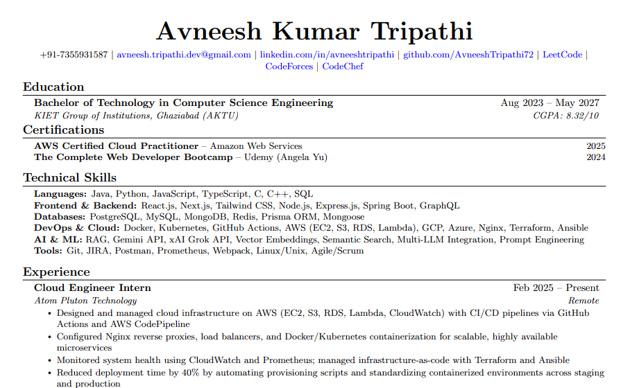

# 🚀 Avneesh Kumar Tripathi - Portfolio

A modern, responsive developer portfolio built with React, Vite, and Tailwind CSS.



## ✨ Features

- **Modern UI** - Clean, dark-themed design with green accents
- **Responsive** - Works on all devices
- **Animated** - Smooth animations with Framer Motion
- **Fast** - Built with Vite for optimal performance
- **SEO Optimized** - Meta tags and semantic HTML

## 🛠️ Tech Stack

- **React 18** - UI Framework
- **Vite** - Build Tool
- **Tailwind CSS** - Styling
- **Framer Motion** - Animations
- **Lucide React** - Icons

## 📂 Sections

- **Hero** - Introduction with resume preview
- **About** - Personal info and skills summary
- **Skills** - Technical skills showcase
- **Projects** - Featured projects with live links
- **Experience** - Competitive programming achievements
- **Contact** - Get in touch form

## 🚀 Quick Start

```bash
# Install dependencies
npm install

# Start development server
npm run dev

# Build for production
npm run build
```

## 📁 Project Structure

```
src/
├── components/
│   ├── About.jsx
│   ├── Contact.jsx
│   ├── Experience.jsx
│   ├── Footer.jsx
│   ├── Hero.jsx
│   ├── Navbar.jsx
│   ├── Projects.jsx
│   └── Skills.jsx
├── App.jsx
├── index.css
└── main.jsx
public/
└── [images]
```

## 🔗 Links

- **GitHub**: [github.com/AvneeshTripathi72](https://github.com/AvneeshTripathi72)
- **LinkedIn**: [linkedin.com/in/avneeshtripathi](https://www.linkedin.com/in/avneeshtripathi/)
- **Email**: avneesh.tripathi.dev@gmail.com

## 📄 License

MIT License - feel free to use this as a template!

---

Made with ❤️ by Avneesh Kumar Tripathi
